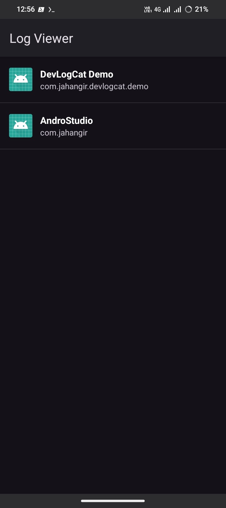
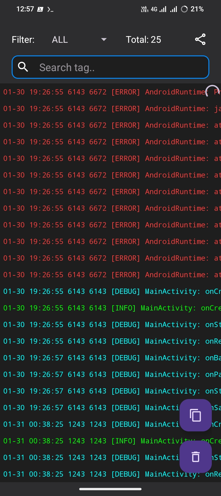
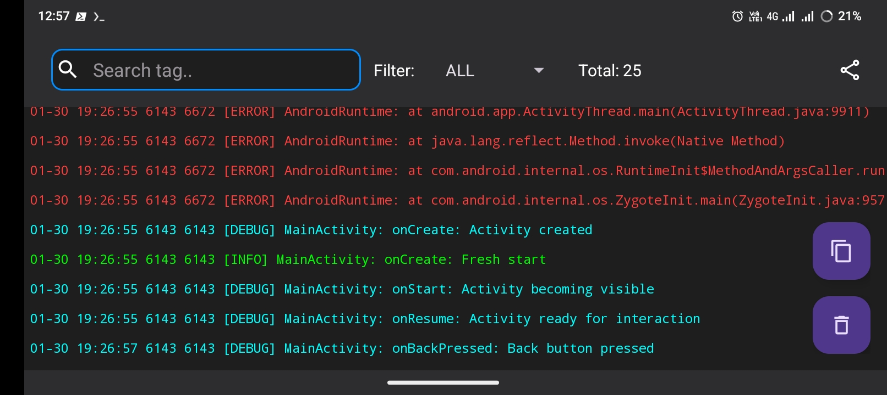

# DevLogCat 📱🧩  

[](https://jitpack.io/#devjhr/DevLogCat)

A lightweight Android logcat library for **for app developers specially AIDE users** — simple, structured, and readable logs **right from your phone**.  
Also perfect for anyone needing fast debugging logs on mobile devices.

---

## ✨ Features

- [x] Easy to use
- [x] Multi APP supported
- [x] Level-based filtering
- [x] Tag-based filtering
- [x] Global Crash Handler (uncaught exceptions)
- [x] Detects app startup crashes
- [x] ⚡ Lightweight, fast, and mobile-friendly
- [x] 🧩 Easy integration with any Android project
- [x] 🚫 No heavy dependencies
- [x] 🔥 Developer-friendly API
---

### Screenshots

<!-- Wrapper for top two portrait images -->
<div style="display: flex; justify-content: center; gap: 10px; margin-bottom: 10px;">
    
    
</div>

<!-- Bottom landscape/rotated image -->
<div style="text-align: center;">
    
</div>

## 📦 Installation

### Step 1 — Add JitPack repository

Add this in **settings.gradle** or **project level build.gradle**

```gradle
dependencyResolutionManagement {
    repositoriesMode.set(RepositoriesMode.FAIL_ON_PROJECT_REPOS)
    repositories {
        google()
        mavenCentral()
        maven { url 'https://jitpack.io' }
    }
}
```
### Step 2 — Add Dependency

Add this in **build.gradle** or **build.gradle.kts**

```gradle
dependencies {
    implementation 'com.github.devjhr:dev-logcat:<version>'
}
```

> **Latest Release:** [](https://github.com/devjhr/DevLogCat/releases/tag/1.0.4)
>
> Check all available versions and release notes on the [GitHub Releases page](https://github.com/devjhr/DevLogCat/releases).

### Usage

```java
import com.jahangir.devlogcat.Log;
```
```java
Log.d("MainActivity", "App started");
Log.i("Auth", "Login success");
Log.w("Network", "Slow response");
Log.e("Crash", "Something went wrong");
```
### Logging

This library uses a **custom `Log`** (`com.jahangir.devlogcat.Log`) instead of Android's default `android.util.Log` for:

- Centralized log handling
- DevLogCat viewer support
- Consistent formatted output

> **Note:** To view logs in real-time on your device, you **must install the companion Log Viewer app** (`com.jahangir.logviewer`). Without it, logs will still print in system logcat but you won’t get the enhanced DevLogCat viewer experience.

### ⚠️ Note for Play Store

If you plan to publish your app on **Google Play**, be aware that **DevLogCat is meant for development only**.  

Before building for release:

- Remove or comment out the `com.jahangir.devlogcat.Log` imports.
- Use Android's default `android.util.Log` instead.
- Make sure all dependencies related to DevLogCat are removed or disabled.

This ensures your app complies with Play Store policies and avoids unnecessary development-only code in production.